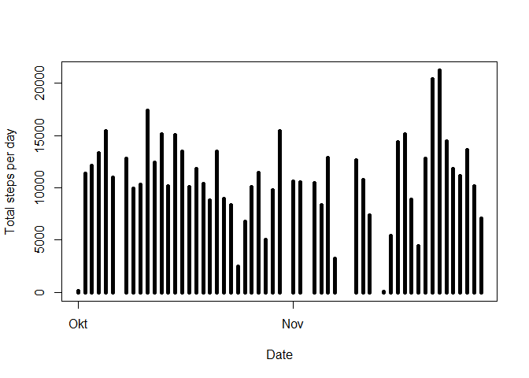
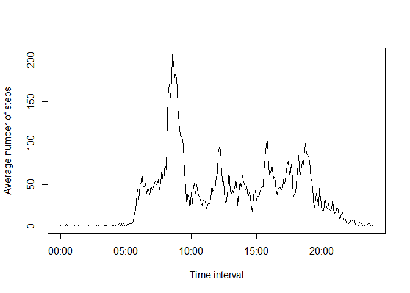
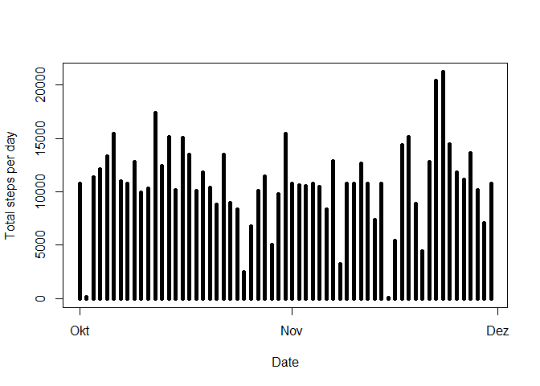
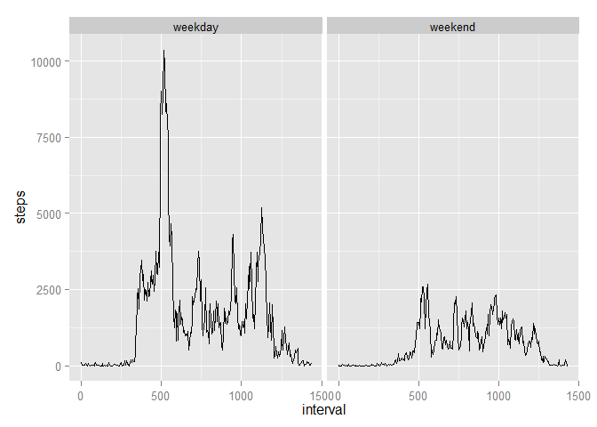

# Reproducible Research: Peer Assessment 1
Maksim Gayduk aka Adensur  


## Loading and preprocessing the data
  
  
First let's read the code. For this step, file activity.zip has to be in R working directory.   


```r
con=unz("activity.zip","activity.csv")
data <- read.csv(con)
head(data,3)
```

```
##   steps       date interval
## 1    NA 2012-10-01        0
## 2    NA 2012-10-01        5
## 3    NA 2012-10-01       10
```
  
  
As we can see, the second column - date - is just a character factor:  
  
  

```r
class(data[,2])
```

```
## [1] "factor"
```
  
  
And the third column - interval - is integer, containing information about time in rather peculiar format:  
  
  


```r
head(data[,3],20)
```

```
##  [1]   0   5  10  15  20  25  30  35  40  45  50  55 100 105 110 115 120
## [18] 125 130 135
```
  
  
That is, the last 2 digits correspond to minutes, while the remaining digits correspond to hours passed after 0:00. Let's construct a column in correct, POSIXct format of date+time:  
  
  


```r
date<-as.POSIXct(data[,2])
x=data[,3]
x=x%/%100*60+x%%100
x=as.POSIXct(x,origin=date)
data[,2]=date
data[,3]=x
summary(data)
```

```
##      steps             date               interval                  
##  Min.   :  0.00   Min.   :2012-10-01   Min.   :2012-10-01 00:00:00  
##  1st Qu.:  0.00   1st Qu.:2012-10-16   1st Qu.:2012-10-16 00:05:58  
##  Median :  0.00   Median :2012-10-31   Median :2012-10-31 00:11:57  
##  Mean   : 37.38   Mean   :2012-10-31   Mean   :2012-10-31 00:11:57  
##  3rd Qu.: 12.00   3rd Qu.:2012-11-15   3rd Qu.:2012-11-15 00:17:56  
##  Max.   :806.00   Max.   :2012-11-30   Max.   :2012-11-30 00:23:55  
##  NA's   :2304
```
  
  
Here i used %/% operator of integer division and %% operator of remains of the integer division.   
  
  
I have also kept the pure date as a second column; that gives me an option to extract just the time by substracting second column from the third.  
  
  


Note that there are some NA's in the data. As the assignement suggests, we will deal with NA's in step 4 of our work. 
For now, let's just make another, NA-free version of data:    


```r
data2=na.omit(data)
```
  
  
## What is mean total number of steps taken per day?  


First of all, lets take a histogram of total steps made each day.  
  
  


```r
steps.day=tapply(data2[,1],as.Date(data2[,3]),FUN=sum)
plot(as.POSIXct(names(steps.day)),steps.day,type="h",lwd=5,xlab="Date",ylab="Total steps per day")
```

 
  
  
Now, the mean of total steps taken per day:  
  
  


```r
mean(steps.day)
```

```
## [1] 10766.19
```
  
  
And the median:  
  
  


```r
median(steps.day)
```

```
## [1] 10765
```
  
  
## What is the average daily activity pattern?  


Now lets calculate the number of steps taken per each interval, averaged accross all days:  
  
  


```r
x=data2[,3]-data2[,2]                                         ##extract time from times and dates
steps.interval=tapply(data2[,1],x,FUN=mean)                   ##calculate mean of steps/interval averaged by all days         
y=steps.interval                                              
x=levels(as.factor(x))
x=as.POSIXct(as.numeric(x),origin=data2[1,2])
plot(x,y,type="l",xlab="Time interval",ylab="Average number of steps")
```

 
  
  
Now, to find out which of the intervals contains maximum number of steps on average:  
  
  


```r
strftime(x[which.max(y)],format="%H:%M:%S")
```

```
## [1] "00:08:35"
```

  
  
## Imputing missing values  
  
  

###1. Calculating and reporting a total number of missing values in initial data set:  


```r
library(scales)          ##needed to show pretty percentage data
a=sum(is.na(data[,1]))
b=percent(sum(is.na(data[,1]))/dim(data)[1])
a
```

```
## [1] 2304
```

```r
b
```

```
## [1] "13.1%"
```
  
  
So, the total amount of NA's is 2304, which is 13.1% of the total data.  


###2.Devising a strategy of imputing missing values.  


Upon manual inspection I saw that some of the days only have NA's, while other days have no NA's at all.   
  
  
Let us prove that fact by splitting the initial set by days and calculating percentage of NA's per each day:  
  
  

```r
data2=split(data,data[,2])
y2=vector("numeric")
for(i in 1:length(data2)){
        x2=data2[[i]]
        y2=c(sum(is.na(x2[,1]))/dim(x2)[1],y2)
}
summary(as.factor(y2))
```

```
##  0  1 
## 53  8
```
  
  
Note that the percentage of NA's per day is either 0 or 1, which means that we have entire days with no data. In this case, it will be useless to try to impute missing values based on the neighbouring 5-minutes intervals; instead, I will replace data for all the missing days with data, averaged accross all the other days for current interval.  
  
  


###3. Imputing NA's in data set  
  
  No commentary :D


```r
x=strftime(x,format="%H%M%S")
for(i in 1:nrow(data)){
        if(is.na(data[i,1])){
                int=strftime(data[i,3],format="%H%M%S")
                data[i,1]=y[which(x==int)]
        }
}
```
  
  
###4. Making a histogram of a total number of steps per day; calculating mean and median of the steps done per day.  


We have already done this, but with slightly different data set  
  
  


```r
steps.day=tapply(data[,1],data[,2],FUN=sum)
plot(as.POSIXct(names(steps.day)),steps.day,type="h",lwd=5,xlab="Date",ylab="Total steps per day")
```

 
   
   
Now the mean and the median:  
  
  


```r
mean(steps.day)
```

```
## [1] 10766.19
```

```r
median(steps.day)
```

```
## [1] 10766.19
```
  
    
    
The mean and the median didn't change that much, but wow - look at that - they are now equal! I guess it happened because i have imputed NA's with mean values, meaning that I added 8 days with total number of steps equal to the mean value; statistically speaking, it makes it very likely that the mean will become equal to median.  
  
  


## Are there differences in activity patterns between weekdays and weekends?  


Creating a weekday/weekend factor:  


```r
library(ggplot2)
x=weekdays(data[,2])
wdays=c("Montag","Dienstag","Mittwoch","Donnerstag","Freitag")
wkend=c("Samstag","Sonntag")
for(i in 1:length(x)){
        if(any(x[i]==wdays)){x[i]="weekday"}
        else if(any(x[i]==wkend)){x[i]="weekend"}
        else{print("Error!")}
}
x=as.factor(x)
data=cbind(data,x)
head(data)
```

```
##       steps       date            interval       x
## 1 1.7169811 2012-10-01 2012-10-01 00:00:00 weekday
## 2 0.3396226 2012-10-01 2012-10-01 00:00:05 weekday
## 3 0.1320755 2012-10-01 2012-10-01 00:00:10 weekday
## 4 0.1509434 2012-10-01 2012-10-01 00:00:15 weekday
## 5 0.0754717 2012-10-01 2012-10-01 00:00:20 weekday
## 6 2.0943396 2012-10-01 2012-10-01 00:00:25 weekday
```
  
  
The rest we already did before = calculate amount of steps taken per interval averaged accross all days, but now separately for weekends and weekdays:  
  
  


```r
data2=data
data2[,3]=data2[,3]-data2[,2]
w=aggregate(steps~interval+x,data=data2,FUN=sum)
w[,1]=as.numeric(w[,1])
qplot(interval,steps,data=w,facets=.~x,geom="line")
```

 

Nice job slacking out on those weekends, dear test subjects!


